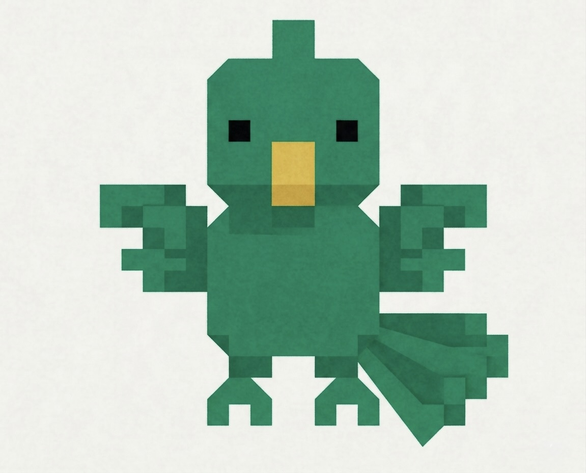

# Parrot



Local-only voice dictation for macOS. Hold a hotkey, speak, and cleaned-up text is injected into whatever app you're using.

Runs entirely on-device using Whisper (STT) + Llama (LLM cleanup). No cloud, no network calls, full privacy.

## Requirements

- macOS 14+
- Xcode Command Line Tools (`xcode-select --install`)
- Apple Silicon Mac (M-series)

## Quick Start

```bash
make start
```

On first launch, grant **Accessibility** and **Microphone** permissions when prompted.

## Install

To install the `.app` bundle (from a [release](../../releases) or `make release`):

1. Move `Parrot.app` to `/Applications`
2. If macOS blocks the app, remove the quarantine flag:
   ```bash
   xattr -dr com.apple.quarantine /Applications/Parrot.app
   ```
   Or right-click the app → **Open** to bypass Gatekeeper.
3. Grant **Accessibility** and **Microphone** permissions when prompted
4. The app appears as an icon in the **menu bar** (top-right) — it does not appear in the Dock

> **Note on signing:** Parrot is distributed with an ad-hoc signature (no Apple Developer Program membership), so macOS will warn you on first open. This is expected and not a sign of malware — the source is open and the app is buildable from source via `make release`.

## Usage

1. The app lives in your **menu bar** (top-right, near WiFi/battery)
2. **Press your shortcut key** to record, **release** to stop (configurable in the Record tab, default: Right Option ⌥)
3. Text is processed and injected into the active app
4. Click the menu bar icon for status and settings

## Commands

| Command | Description |
|---|---|
| `make start` | Build and run (debug) |
| `make release` | Build `.app` bundle + DMG installer for distribution |
| `make build` | Build only |
| `make clean` | Clean build artifacts |

## Models

Place model files in `~/Library/Application Support/Parrot/Models/`, or drag-and-drop them onto the model cards in Settings.

### Whisper (Speech-to-Text)

| Model | Size | Notes |
|---|---|---|
| **`ggml-large-v3-turbo.bin`** | ~1.6 GB | **Recommended.** Best accuracy at near-real-time speed. Uses a distilled decoder (4 layers vs 32) so it runs ~4x faster than large-v3 with minimal quality loss. |
| `ggml-base.en.bin` | ~142 MB | Lightweight alternative for constrained setups. English-only. |

[Download Whisper models](https://huggingface.co/ggerganov/whisper.cpp/tree/main)

### LLM (Text Cleanup)

The LLM cleans up raw transcriptions — fixing punctuation, capitalization, filler words, and misheard words. The task is simple but benefits from strong instruction-following.

| Model | Size | RAM Usage | Notes |
|---|---|---|---|
| **`Llama-3.1-70B-Instruct-Q4_K_M.gguf`** | ~40 GB | ~43 GB | **Recommended for 128 GB+ Macs.** Fits entirely in unified memory with full Metal offload. Excellent at subtle cleanup decisions — ambiguous phrasing, proper nouns, context-dependent edits. Sub-second response for short transcriptions on Apple Silicon. |
| `Llama-3.1-8B-Instruct-Q8_0.gguf` | ~8.5 GB | ~10 GB | Good for 16-32 GB Macs. Handles straightforward cleanup well, but less reliable on edge cases. Q8 quantization since the model is small enough to run at near-full precision. |

Parrot uses the Llama 3 chat template. Other Llama 3.x instruction-tuned models (e.g., Llama 3.3) are also compatible.

[Download Llama models](https://huggingface.co/models?search=llama+3.1+instruct+gguf)

### Why these models?

- **Whisper large-v3-turbo over base/small**: Dictation accuracy matters — misheard words compound into wrong LLM corrections. The turbo variant eliminates the speed penalty of going large.
- **70B over 8B for cleanup**: The task looks simple, but the quality gap shows in subtle decisions: when to keep a filler word that's intentional, fixing misheard proper nouns from context, preserving tone. 70B handles these reliably; 8B sometimes overcorrects.
- **Q4_K_M for 70B, Q8 for 8B**: Token generation is memory-bandwidth-bound on Apple Silicon. Q4_K_M keeps the 70B model fast while retaining quality. The 8B is small enough that Q8 adds negligible overhead.
- **All inference is local**: Models run fully on-device via whisper.cpp and llama.cpp with Metal GPU acceleration. No data leaves your machine.

Configure model paths in the menu bar → Models tab.

## Architecture

```
Hold Hotkey → Audio Capture → Whisper STT → LLM Cleanup → Paste into Active App
```

All inference runs locally via whisper.cpp and llama.cpp with Metal GPU acceleration.

## Model Licenses

The Parrot application code is Apache 2.0 licensed, but the downloadable models have their own licenses:

- **Whisper models** — [MIT License](https://github.com/openai/whisper/blob/main/LICENSE). No restrictions beyond attribution.
- **Llama 3.1 models** — [Meta Llama 3.1 Community License](https://github.com/meta-llama/llama-models/blob/main/models/llama3_1/LICENSE). Key terms:
  - You must comply with Meta's [Acceptable Use Policy](https://github.com/meta-llama/llama-models/blob/main/models/llama3_1/USE_POLICY.md)
  - A separate license from Meta is required if your product has 700M+ monthly active users
  - Attribution: "Built with Llama" is required for derivative works and services

By downloading models through Parrot, you agree to their respective license terms.

## Troubleshooting

**App won't launch / "unidentified developer" warning**
Remove the quarantine attribute and try again:
```bash
xattr -dr com.apple.quarantine /Applications/Parrot.app
```

**Hotkey not working (Right Option does nothing)**
- Open **System Settings → Privacy & Security → Accessibility**
- Make sure **Parrot** is listed and toggled **on**
- If you previously used `make start`, the debug binary gets a separate Accessibility grant — the `.app` bundle needs its own
- After granting permission, **quit and relaunch** Parrot

**Accessibility prompt keeps appearing after updating the app**
Each rebuild produces a new ad-hoc code signature, which invalidates the previous Accessibility grant. Reset and re-grant:
```bash
tccutil reset Accessibility com.parrot.app
```
Then relaunch Parrot and approve the permission when prompted.

**Menu bar icon not visible**
- Parrot is a menu bar-only app — look in the top-right area (near WiFi/battery), not the Dock
- If you use a menu bar manager (Bartender, Hidden Bar, Ice, etc.), it may auto-hide new status items. Check the app's hidden items list.

## Privacy

Parrot runs entirely on your device. See [PRIVACY.md](PRIVACY.md) for the full privacy policy.

## License

Parrot is licensed under the [Apache License 2.0](LICENSE).

- [NOTICE](NOTICE) — attribution for bundled third-party code.
- [THIRD-PARTY-LICENSES.md](THIRD-PARTY-LICENSES.md) — full breakdown of bundled frameworks and downloadable model licenses.

Parrot is provided **as is, without warranty of any kind**. You are responsible for the models you download, your compliance with their licenses, and how you use the transcribed output.
